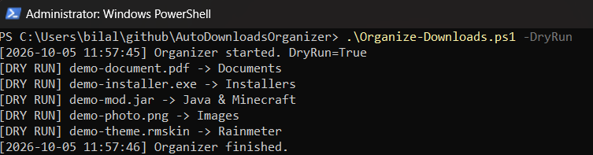

# 📂 AutoDownloadsOrganizer

A lightweight PowerShell utility that automatically organizes your Windows **Downloads** folder by file type.

Instead of letting Downloads turn into a mess, AutoDownloadsOrganizer sorts files into clean categories such as **Images, Videos, Documents, Archives, Installers, Code, Android files, Rainmeter skins, Minecraft files, and more**.

V5 adds a full **Windows GUI control center**, **system tray controls**, one-click organization, monitoring controls, configuration access, startup management, and tray notifications.

---

## 🎬 Demo

See what AutoDownloadsOrganizer will do before moving anything:



Use `-DryRun` to preview all file movements safely:

```powershell
.\Organize-Downloads.ps1 -DryRun
```

---

## ✨ Features

- 📁 Automatically sorts files by extension
- 🖥️ GUI control center
- 📌 System tray support
- 👀 Real-time Downloads folder monitoring
- 🎯 Processes only the newly detected file in real-time mode
- 📥 Queues file events while downloads finish
- 🔁 Rescans Downloads if the watcher reports lost events
- 🔒 Prevents multiple watcher instances from running at the same time
- 🧯 Filters duplicate filesystem events
- ⏳ Waits until downloads are finished before moving them
- ⚙️ Fully configurable using `config.json`
- 🧪 Safe `-DryRun` mode before moving anything
- 🔄 Prevents duplicate files from being overwritten
- 📝 Creates an activity log
- 🚀 Optional automatic startup when you sign in to Windows
- 🗑️ Easy startup removal with `Uninstall.ps1`
- 🔔 Tray notifications
- 📂 One-click access to Downloads
- ⚙️ One-click access to configuration
- 📝 One-click access to logs
- 📦 Supports many common file types
- ❓ Unknown files can automatically go into an `Other` folder
- 💻 No third-party software required
- 🔒 Does not require administrator privileges for normal use

---

## 📁 Project Structure

```text
AutoDownloadsOrganizer/
├── assets/
│   └── dryrun-demo.png
├── AutoDownloadsOrganizer.ps1
├── Organize-Downloads.ps1
├── Watch-Downloads.ps1
├── Install.ps1
├── Uninstall.ps1
├── config.json
├── README.md
├── LICENSE
└── .gitignore
```

---

## 🗂️ Default Categories

AutoDownloadsOrganizer can sort files into categories such as:

| Category | Examples |
|---|---|
| 🖼️ Images | `.png`, `.jpg`, `.jpeg`, `.webp`, `.gif`, `.svg` |
| 🎬 Videos | `.mp4`, `.mkv`, `.mov`, `.avi`, `.webm` |
| 🎵 Music | `.mp3`, `.wav`, `.flac`, `.m4a`, `.ogg` |
| 📄 Documents | `.pdf`, `.docx`, `.pptx`, `.xlsx`, `.txt`, `.csv` |
| 📦 Archives | `.zip`, `.rar`, `.7z`, `.tar`, `.gz` |
| 💿 Installers | `.exe`, `.msi`, `.msix`, `.appx`, `.appxbundle` |
| 🤖 Android | `.apk`, `.aab`, `.xapk`, `.apks` |
| 💽 Disk Images | `.iso`, `.img`, `.vhd`, `.vhdx` |
| 🔤 Fonts | `.ttf`, `.otf`, `.woff`, `.woff2` |
| 💻 Code | `.py`, `.js`, `.dart`, `.java`, `.cpp`, `.ps1`, `.gd`, and more |
| 🌧️ Rainmeter | `.rmskin` |
| ☕ Java & Minecraft | `.jar`, `.mcpack`, `.mcworld`, `.mcaddon` |
| 🎮 Game Files | Additional supported game-related formats |
| 📂 Other | Anything that does not match another category |

You can add, remove, or rename categories in `config.json`.

---

# 🚀 Installation

## Option 1 — Clone with Git

Open PowerShell and run:

```powershell
git clone https://github.com/Bilal-Bast/AutoDownloadsOrganizer.git
cd AutoDownloadsOrganizer
```

## Option 2 — Download ZIP

1. Click the green **Code** button on GitHub.
2. Select **Download ZIP**.
3. Extract the ZIP.
4. Open PowerShell inside the extracted folder.

---

# 🖥️ Launch the V5 Control Center

Run:

```powershell
.\AutoDownloadsOrganizer.ps1
```

This opens the V5 GUI.

The control center includes:

```text
AutoDownloadsOrganizer V5

Real-time monitoring: ON / OFF

[ Organize Now ]        [ Dry Run ]

[ Start Monitoring ]    [ Stop Monitoring ]

[ Open Downloads ]      [ Edit Configuration ]

[ Open Activity Log ]   [ Open Project Folder ]

[ Enable Startup ]      [ Disable Startup ]
```

You can manage most features without manually typing PowerShell commands.

---

# 📌 System Tray

V5 includes a system tray icon.

When you minimize or close the main window, the control center can remain available from the system tray.

Right-click the tray icon to access:

```text
Open AutoDownloadsOrganizer
Organize Now

Start Monitoring
Stop Monitoring

Open Downloads

Exit
```

Double-click the tray icon to reopen the main window.

---

# 🔔 Tray Notifications

V5 can show tray notifications for actions such as:

```text
Monitoring Started
Monitoring Stopped
Organization Complete
```

These notifications help confirm actions without requiring the main window to stay open.

---

# 🧹 Organize Now

From the GUI, click:

```text
Organize Now
```

or run manually:

```powershell
.\Organize-Downloads.ps1
```

Your current Downloads folder will be organized immediately.

The GUI runs this work in the background so its controls remain responsive. If any file move fails, the GUI reports it and records the result in `organizer.log`.

Example:

```text
Downloads/
├── Images/
├── Videos/
├── Music/
├── Documents/
├── Archives/
├── Installers/
├── Android/
├── Disk Images/
├── Fonts/
├── Code/
├── Rainmeter/
├── Java & Minecraft/
├── Game Files/
└── Other/
```

---

# 🧪 Dry Run

Dry Run lets you preview what would happen without moving files.

From the GUI, click:

```text
Dry Run
```

or run:

```powershell
.\Organize-Downloads.ps1 -DryRun
```

Example:

```text
[DRY RUN] wallpaper.png -> Images
[DRY RUN] setup.exe -> Installers
[DRY RUN] app-release.apk -> Android
[DRY RUN] fabric-api.jar -> Java & Minecraft
[DRY RUN] theme.rmskin -> Rainmeter
```

> Dry Run does not move your files, although normal logging may still occur.

---

# 👀 Real-Time Monitoring

AutoDownloadsOrganizer continuously watches your Downloads folder and automatically organizes new files as they arrive.

Start monitoring from the GUI:

```text
Start Monitoring
```

or manually:

```powershell
.\Watch-Downloads.ps1
```

You should see:

```text
AutoDownloadsOrganizer V5
Watching: C:\Users\YourName\Downloads
Single-instance protection: Enabled
Press Ctrl+C to stop.
```

The GUI will show:

```text
Real-time monitoring: ON
```

When monitoring is stopped:

```text
Real-time monitoring: OFF
```

---

## How Real-Time Monitoring Works

When a new file appears, AutoDownloadsOrganizer:

1. Detects the file
2. Ignores temporary download files
3. Filters duplicate filesystem events
4. Queues events while the file finishes downloading
5. Retries when the file is still busy
6. Sends only that file to the organizer
7. Rescans Downloads if the watcher reports an event error
8. Moves it into the correct category

Example:

```text
Detected: wallpaper.png
Checking whether the file is ready...
Organizing...
Moved 'wallpaper.png' -> 'Images'
Done.
```

---

## ⚡ Optimized Per-File Processing

Real-time mode does not need to scan the entire Downloads folder every time a new file arrives.

Instead:

```text
New file
   ↓
Wait until ready
   ↓
Process only that file
   ↓
Move it
   ↓
Continue watching
```

The watcher uses:

```powershell
.\Organize-Downloads.ps1 -FilePath "C:\Users\YourName\Downloads\example.png"
```

internally.

---

## 🔒 Single-Instance Protection

Only one real-time watcher can run at a time.

If the watcher is already running and another instance is launched:

```text
AutoDownloadsOrganizer is already running.
```

The second instance exits automatically.

This helps prevent duplicate file processing.

---

## 🧯 Duplicate Event Protection

Windows `FileSystemWatcher` can sometimes report the same file more than once.

AutoDownloadsOrganizer tracks recently processed paths and filters repeated events within a short period.

---

## ⏳ Temporary Download Protection

AutoDownloadsOrganizer ignores common temporary download extensions such as:

```text
.crdownload
.part
.partial
.tmp
.download
```

It waits for the final file before organizing it.

This helps prevent partially downloaded or locked files from being moved too early.

---

# ⚙️ Configuration

All settings and categories are stored inside:

```text
config.json
```

The GUI provides an:

```text
Edit Configuration
```

button that opens the file in Notepad.

The default Downloads location is:

```json
"downloadsPath": "%USERPROFILE%\\Downloads"
```

You can change it:

```json
"downloadsPath": "D:\\Downloads"
```

---

## 👀 Watcher Configuration

V4/V5 includes configurable watcher timing.

Example:

```json
"watcher": {
  "checkIntervalMilliseconds": 1000,
  "postReadyDelayMilliseconds": 500
}
```

### `checkIntervalMilliseconds`

Controls how long the watcher waits before checking again when a file is still locked.

Default:

```text
1000 ms
```

### `postReadyDelayMilliseconds`

Adds a small extra delay after the file becomes available.

Default:

```text
500 ms
```

This helps avoid moving a file while an application is performing final write operations.

---

## Add Your Own Category

You can create custom categories inside `config.json`.

Example:

```json
"3D Models": [
  ".blend",
  ".fbx",
  ".obj",
  ".stl"
]
```

AutoDownloadsOrganizer will automatically create:

```text
Downloads\3D Models
```

and move matching files there.

---

## Unknown Files

By default:

```json
"moveUnknownFiles": true
```

Unknown files will be moved into:

```text
Other
```

To leave unknown files untouched:

```json
"moveUnknownFiles": false
```

---

# 🚀 Windows Startup

The GUI provides:

```text
Enable Windows Startup
```

or you can manually run:

```powershell
.\Install.ps1
```

This creates a Windows Startup shortcut that launches:

```text
Watch-Downloads.ps1
```

when you sign in to Windows.

The watcher runs quietly in the background.

The GUI itself does not need to start automatically.

---

# 🗑️ Disable Windows Startup

From the GUI:

```text
Disable Windows Startup
```

or run:

```powershell
.\Uninstall.ps1
```

This removes the startup shortcut.

It does **not** delete:

- Your Downloads
- Organized files
- AutoDownloadsOrganizer
- Your configuration

---

# 📂 Open Downloads

The GUI includes:

```text
Open Downloads
```

which opens the configured Downloads folder directly in File Explorer.

---

# 📝 Activity Log

AutoDownloadsOrganizer records activity in:

```text
organizer.log
```

The GUI includes:

```text
Open Activity Log
```

to open the log directly.

Example:

```text
[2026-10-05 12:14:01] Organizer started. DryRun=False
[2026-10-05 12:14:01] Moved 'wallpaper.png' -> 'Images'
[2026-10-05 12:14:01] Organizer finished.
```

Watcher messages may look like:

```text
[2026-10-05 12:14:00] [Watcher] V5 watcher started.
```

---

# 🔒 Duplicate File Protection

AutoDownloadsOrganizer will **not overwrite an existing file**.

If:

```text
wallpaper.png
```

already exists, another file with the same name becomes:

```text
wallpaper (1).png
```

then:

```text
wallpaper (2).png
```

and so on.

---

# 🛡️ Safety

AutoDownloadsOrganizer:

- Does not delete your downloaded files
- Does not overwrite duplicate files
- Supports `-DryRun`
- Waits for downloads to finish
- Ignores common temporary download files
- Prevents multiple watcher instances
- Filters duplicate filesystem events
- Organizes only the configured directory
- Rejects single-file requests outside the Downloads root
- Skips reparse-point source files and category folders
- Does not require administrator privileges for normal use

Always test new configuration changes with Dry Run first.

---

# 🖥️ Requirements

- Windows 10 or Windows 11
- Windows PowerShell 5.1+ or compatible PowerShell
- Git is optional and only needed when cloning the repository

The V5 GUI uses built-in Windows components:

```text
System.Windows.Forms
System.Drawing
```

No third-party GUI framework is required.

---

# ⚠️ PowerShell Execution Policy

If Windows prevents the scripts from running, you can allow locally created scripts for your account:

```powershell
Set-ExecutionPolicy -Scope CurrentUser RemoteSigned
```

Check current policies with:

```powershell
Get-ExecutionPolicy -List
```

---

# 🧰 Scripts

## `AutoDownloadsOrganizer.ps1`

Launches the V5 GUI and system tray control center.

```powershell
.\AutoDownloadsOrganizer.ps1
```

---

## `Organize-Downloads.ps1`

Organizes Downloads once.

```powershell
.\Organize-Downloads.ps1
```

Dry Run:

```powershell
.\Organize-Downloads.ps1 -DryRun
```

Single-file mode:

```powershell
.\Organize-Downloads.ps1 -FilePath "C:\Users\YourName\Downloads\example.png"
```

---

## `Watch-Downloads.ps1`

Runs the real-time watcher.

```powershell
.\Watch-Downloads.ps1
```

Includes:

- Single-instance protection
- Duplicate event protection
- File-ready checking
- Per-file processing
- Temporary file filtering

---

## `Install.ps1`

Enables the watcher at Windows startup.

```powershell
.\Install.ps1
```

---

## `Uninstall.ps1`

Removes the Windows Startup shortcut.

```powershell
.\Uninstall.ps1
```

---

# 🧪 Testing V5

## Test the GUI

Run:

```powershell
.\AutoDownloadsOrganizer.ps1
```

Confirm the GUI opens.

---

## Test Start Monitoring

Click:

```text
Start Monitoring
```

The status should become:

```text
Real-time monitoring: ON
```

Create a test file:

```powershell
New-Item "$env:USERPROFILE\Downloads\v5-test.png" -ItemType File
```

Verify:

```powershell
Test-Path "$env:USERPROFILE\Downloads\Images\v5-test.png"
```

Expected:

```text
True
```

---

## Test Stop Monitoring

Click:

```text
Stop Monitoring
```

Status:

```text
Real-time monitoring: OFF
```

Create:

```powershell
New-Item "$env:USERPROFILE\Downloads\v5-stop-test.png" -ItemType File
```

It should remain in the root Downloads folder until you click:

```text
Organize Now
```

---

## Test System Tray

Minimize or close the GUI.

Find the AutoDownloadsOrganizer icon in the Windows system tray.

Test:

- Open AutoDownloadsOrganizer
- Organize Now
- Start Monitoring
- Stop Monitoring
- Open Downloads
- Exit

---

# 📌 Version History

## V5

- 🖥️ Added Windows GUI control center
- 📌 Added system tray support
- ▶️ Added Start Monitoring button
- ⏹️ Added Stop Monitoring button
- 🧹 Added one-click organization
- 🧪 Added GUI Dry Run launcher
- 📂 Added Open Downloads shortcut
- ⚙️ Added configuration shortcut
- 📝 Added activity log shortcut
- 💻 Added project folder shortcut
- 🚀 Added startup controls
- 🔔 Added tray notifications
- ➖ Added minimize-to-tray behavior
- 📥 Queued watcher events and added recovery scans after watcher errors

## V4

- 🔒 Added single-instance watcher protection
- 🎯 Added per-file real-time processing
- 🧯 Added duplicate filesystem event protection
- ⚡ Improved real-time performance
- ⚙️ Added configurable watcher timing
- 📝 Improved watcher logging

## V3

- 👀 Added real-time Downloads monitoring
- ⏳ Added file-ready detection
- 🧩 Added temporary download handling

## V2

- ⚙️ Added `config.json`
- 🧪 Added `-DryRun`
- 📝 Added logging
- 🚀 Added startup installer
- 🗑️ Added startup uninstaller
- 📦 Added additional file categories

## V1

- 📁 Initial file organization by extension
- 🔄 Duplicate filename protection

---

# 🤝 Contributing

Contributions are welcome!

You can:

- Add support for more file types
- Suggest new categories
- Improve PowerShell code
- Improve the GUI
- Improve documentation
- Report bugs
- Suggest new features

Feel free to open an **Issue** or submit a **Pull Request**.

---

# 🗺️ Planned Features

Possible future improvements include:

- 🎨 Modern Windows 11-style GUI redesign
- ✏️ Built-in category editor
- 🖼️ Custom application icon
- 📦 Standalone executable / installer
- ↩️ Undo last organization
- 📊 Organization statistics
- 📅 Sort files by date
- 🧠 Smarter file detection
- 🔔 More configurable notifications
- ℹ️ About / version page

---

# 📜 License

This project is licensed under the **MIT License**.

See the `LICENSE` file for details.

---

## ⭐ Like the Project?

If AutoDownloadsOrganizer is useful to you, consider giving the repository a ⭐ on GitHub!

Made with PowerShell for a cleaner Windows Downloads folder. 🧹
